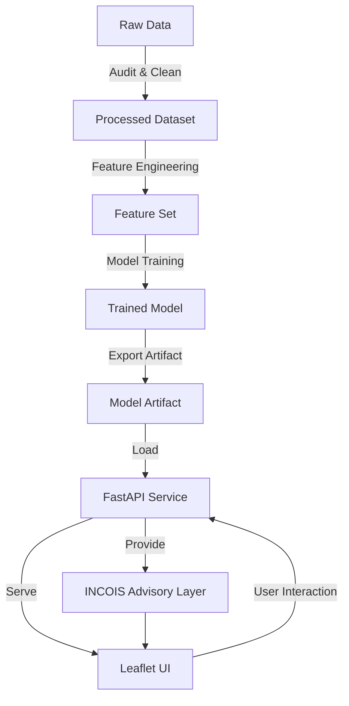

# Design Diagram

```mermaid
flowchart TD
    RawData[Raw Data]
    RawData -->|Audit & Clean| ProcessedData[Processed Dataset]
    ProcessedData -->|Feature Engineering| Features[Feature Set]
    Features -->|Model Training| Model[Trained Model]
    Model -->|Export Artifact| Artifact[Model Artifact]
    Artifact -->|Load| API[FastAPI Service]
    API -->|Serve| Frontend[Leaflet UI]
    Frontend -->|User Interaction| API
    API -->|Provide| Advisory[INCOIS Advisory Layer]
    Advisory --> Frontend
```

