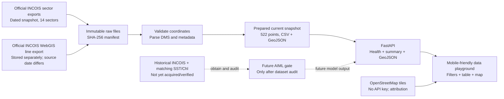

# OCEANIX Stage 1 Data Playground

```mermaid
flowchart LR
    INCOIS[Official INCOIS sector exports\nDated snapshot, 14 sectors]
    WFS[Official INCOIS WebGIS line export\nStored separately; source date differs]
    Raw[Immutable raw files\nSHA-256 manifest]
    Prep[Validate coordinates\nParse DMS and metadata]
    Derived[Prepared current snapshot\n522 points, CSV + GeoJSON]
    API[FastAPI\nHealth + summary + GeoJSON]
    UI[Mobile-friendly data playground\nFilters + table + map]
    OSM[OpenStreetMap tiles\nNo API key; attribution]
    Hist[Historical INCOIS + matching SST/Chl\nNot yet acquired/verified]
    AIML[Future AIML gate\nOnly after dataset audit]

    INCOIS --> Raw --> Prep --> Derived --> API --> UI
    WFS --> Raw
    OSM --> UI
    Hist -. obtain and audit .-> AIML
    AIML -. future model output .-> API
```

The first build exposes the official advisory data only. The old WIO model pipeline is not connected to the INCOIS playground.
